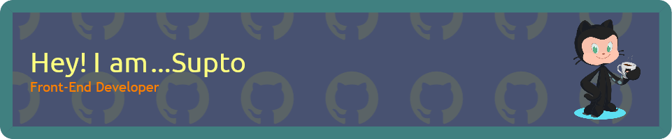

<h1 align="center">Hello 👋, I'm Sahariar Hosen Supto</h1>
<h3 align="center">A passionate Frontend Developer pursuing Computer Science & Engineering</h3>

---

### 🛠 About Me

- 🔭 I’m currently working on building engaging, user-friendly web applications.
- 🌱 I’m exploring advanced **React**, **Node.js**, and **UI/UX Design**.
- 👨‍💻 Check out all my projects at: [My Portfolio](https://dev-sahariarsupto.web.app)
- 📫 You can reach me at: **supto.cse.vu@gmail.com**

---

### 🌐 Connect With Me

  
  
  
  

---

### 🛠 Technologies & Tools

  
  
  
  
  
  
  
  
  
  
  
  
  
  
  
  

---

### 📊 GitHub Stats

  
   
  

---

### ✨ Fun Fact
> I'm passionate about learning, exploring new technologies, and making designs that speak!

---

